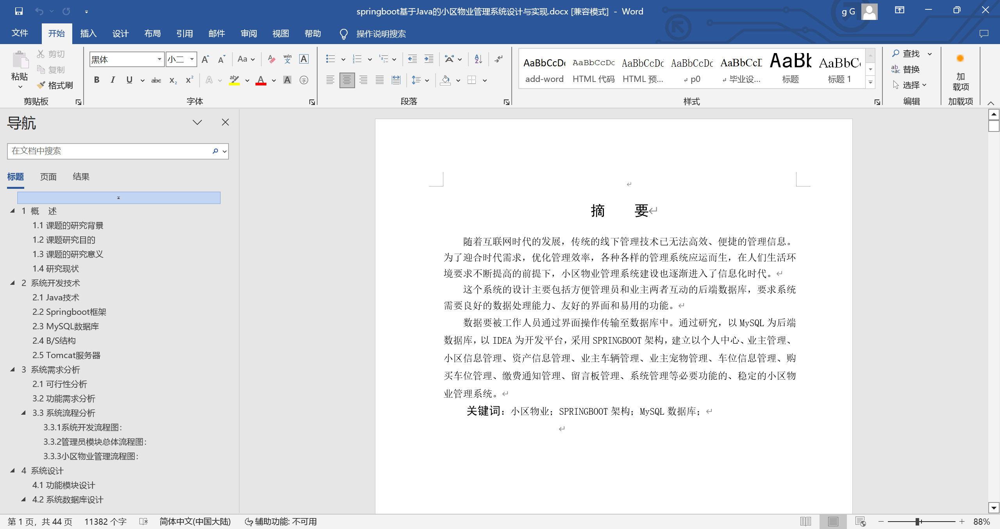
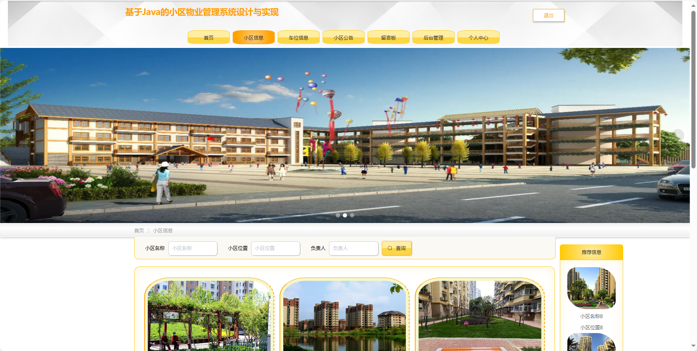
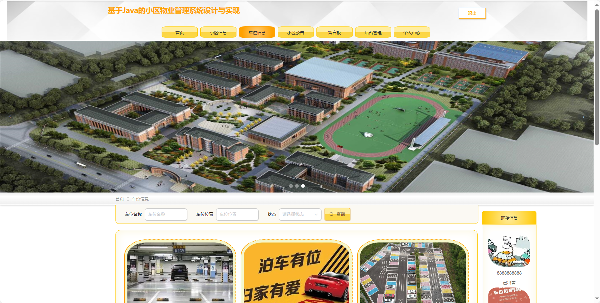
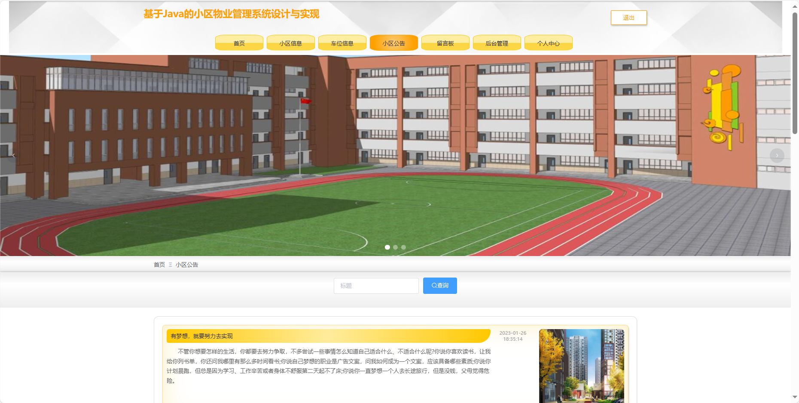
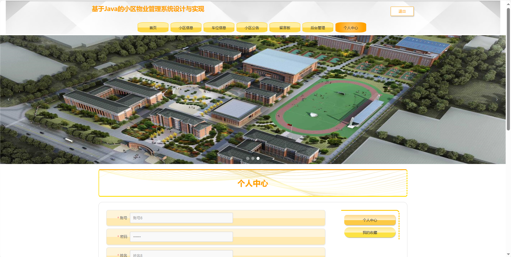
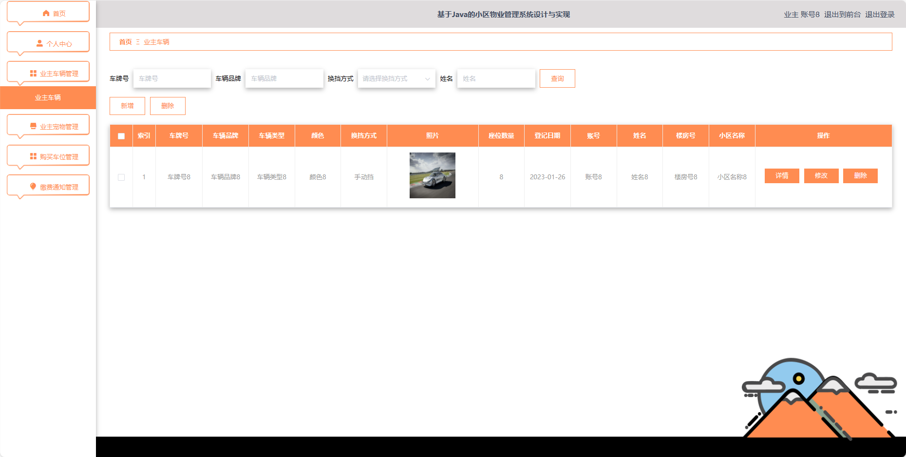
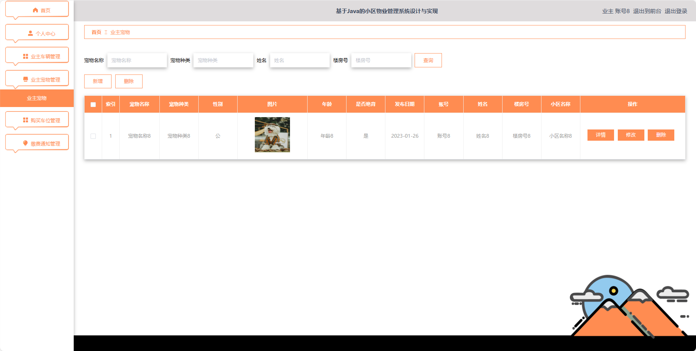
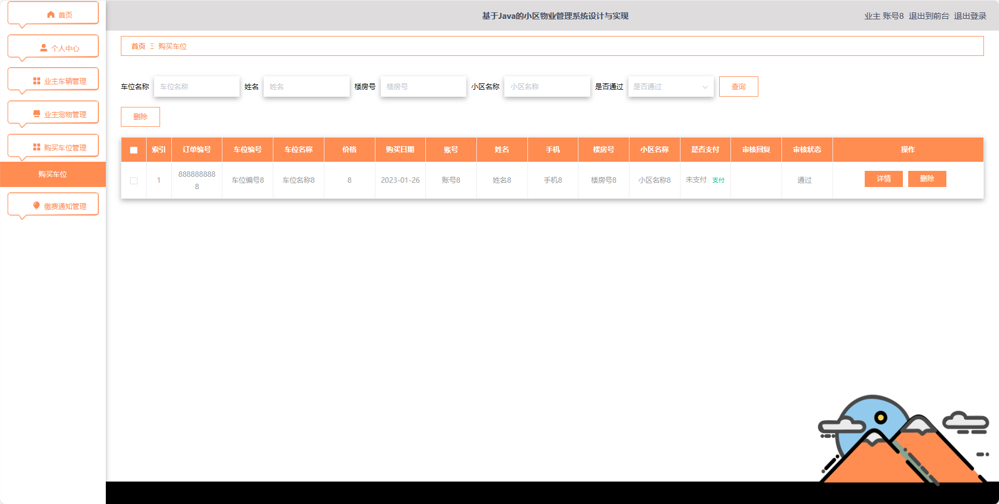
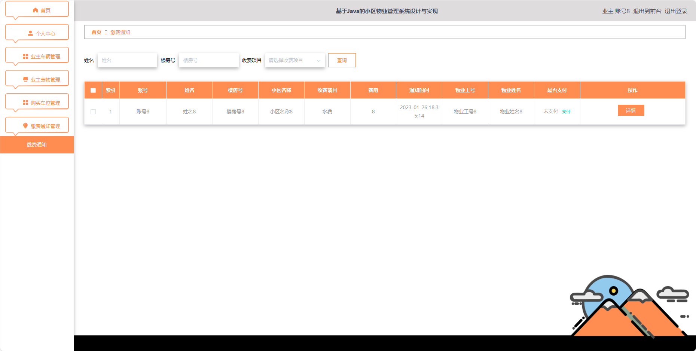

## 基于SpringBoot的小区物业管理系统(程序+报告)

###  获取sql数据库文件: 从戎源码网 (https://armycodes.com/) QQ: 386869957 QQ群: 377586148
###  所有系统地址: (https://github.com/YuLin-Coder/AllProjectCatalog) 
###  所有项目以及源代码本人均调试运行无问题 可支持远程安装部署调试、定制修改、代码讲解

## 项目介绍
基于SpringBoot的小区物业管理系统，系统包含两种角色：管理员、用户,系统分为前台和后台两大模块，主要功能如下。

### 【管理员】:
1. 首页：提供管理员进入后台管理的入口。
2. 个人中心：管理员可以管理个人信息。
3. 业主管理：添加、编辑、删除业主账号。
4. 小区信息管理：管理小区的基本信息。
5. 物业人员管理：添加、编辑、删除物业人员账号。
6. 资产信息管理：管理小区的资产信息。
7. 业主车辆管理：查看、编辑、删除业主的车辆信息。
8. 业主宠物管理：查看、编辑、删除业主的宠物信息。
9. 车位信息管理：管理小区的车位信息。
10. 购买车位管理：查看和管理业主购买的车位信息。
11. 缴费通知管理：发布、编辑、删除物业费用通知。
12. 留言板管理：管理留言板上的信息。
13. 系统管理：管理系统的基础设置。

### 【用户】:
1. 首页：提供用户进入后台管理的入口。
2. 个人中心：用户可以管理个人信息。
3. 业主车辆管理：用户可以添加、编辑、删除自己的车辆信息。
4. 业主宠物管理：用户可以添加、编辑、删除自己的宠物信息。
5. 购买车位管理：用户可以查看和管理自己购买的车位信息。
6. 缴费通知管理：用户可以查看小区物业费用通知。

### 【物业人员】:
1. 首页：提供物业人员进入后台管理的入口。
2. 个人中心：物业人员可以管理个人信息。
3. 资产信息管理：管理小区的资产信息。
4. 缴费通知管理：物业人员可以发布、编辑、删除物业费用通知。

### 【前台】:
1. 首页：提供用户进入系统的入口。
2. 小区信息：用户可以查看小区的基本信息。
3. 车位信息：用户可以查询和管理小区的车位信息。
4. 小区公告：展示小区发布的最新通知和公告。
5. 留言板：用户可以在留言板上发表意见、提问等。
6. 后台管理：提供进入后台管理的入口。
7. 个人中心：用户可以管理个人信息。

## 项目技术
- 编程语言：Java
- 数据库：MySQL
- 项目管理工具：Maven
- 前端技术：HTML、CSS、JavaScript、Jquery、Vue
- 后端技术：Spring、SpringMVC、MyBatis

## 运行环境
- JDK版本：JDK1.8及以上
- 开发工具：IDEA、Ecplise、Myecplise都可以
- 数据库: MySQL5.7及以上
- Maven：maven3.0及以上
- Node：14.14.0及以上

## 运行截图

